# Creating a Module

> This tutorial references the following resources:
> * [SDG.Framework.Modules.EModuleRole](scripting/sdg/framework/modules/emodulerole)
> * [SDG.Framework.Modules.IModuleNexus](scripting/sdg/framework/modules/imodulenexus)

## 1. Installing Tools

You will need the following tools to get started:

* [Unturned Server](http://unturned.wikia.com/wiki/Hosting_a_Dedicated_Server)
* [Visual Studio 2017 IDE](https://visualstudio.microsoft.com/vs/)
* [Visual Studio .NET 3.5 SDK](https://www.microsoft.com/en-us/download/details.aspx?id=21)

## 2. Setting up a Workspace

Once everything is installed and setup correctly, we will create the project in Visual Studio.

Select `File` -> `New` -> `Project`

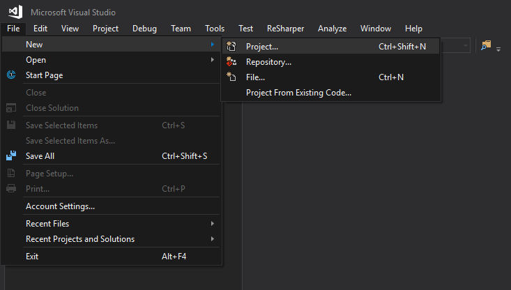

Select `Other Languages` -> `Visual C#` -> `Class Library (.NET Framework)`

Set the name and location for your project, and make sure `Framework` is set to `.NET Framework 3.5`.

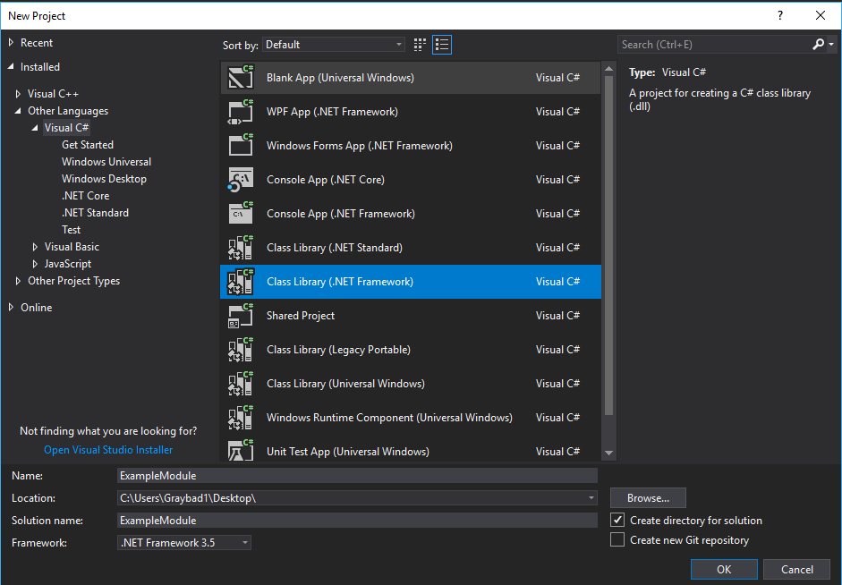

Finally, navigate to the project directory inside the Windows File Explorer, and create a folder called `lib`.

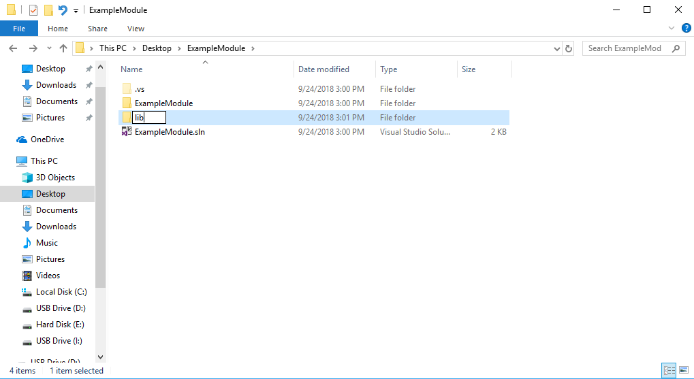

## 3. Setting up References

Once you have the `lib` folder created, you will need to use the File Explorer to navigate to the folder of your Unturned Server installation.

Navigate to `Unturned_Data` -> `Managed`.

Copy `Assembly-CSharp.dll`, `Assembly-CSharp-firstpass.dll`, and `UnityEngine.dll` to the `lib` folder in your project directory.

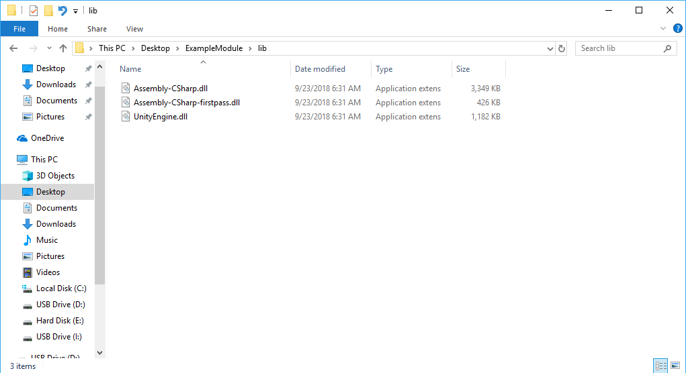

Back in Visual Studio, right click `References` then click `Add Reference`.

You should now see a screen like this:

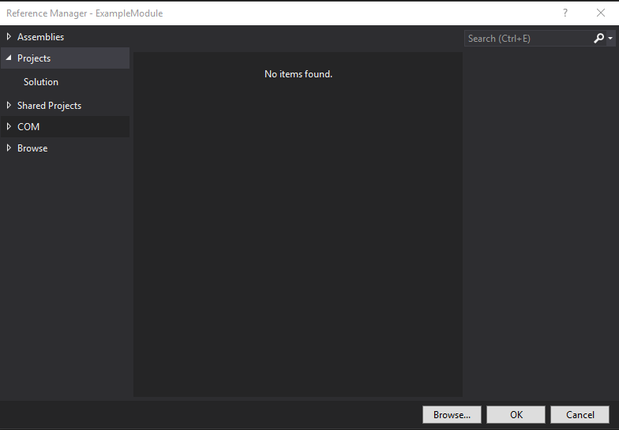

Navigate to `Browse` -> `Browse` and navigate to your project folder then `lib`. Use `CTRL + A` to select all three files, and click `Add`.


Press `OK` to exit out of the references page.

Now press the `Properties` bar on the right while you have `Assembly-CSharp` highlighted on the left and set `Copy Local` to `False`.

Do this with `Assembly-CSharp-firstpass.dll` and `UnityEngine.dll`

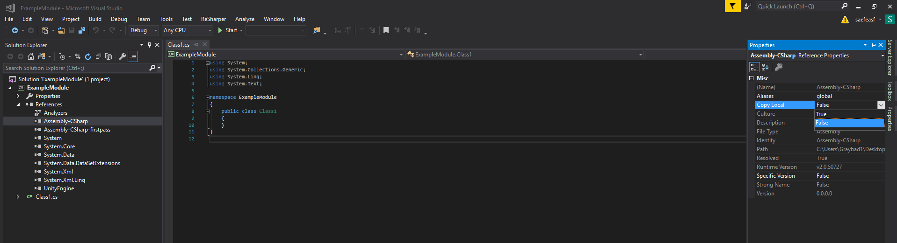

## 4. Setting up Module Files

Add two new files to your project. Right click your project on the left hierarchy and select `Add` -> `New Item` and select `Text File`. Create one named `English.dat` and one other with any name you would like bu the extension of `.module`.

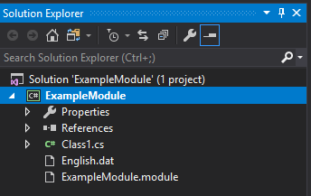

Now press the `Properties` bar on the right while you have `English.dat` highlighted on the left and set `Copy to Output Directory` to `Always copy`.

Do the same for the `.module` file.

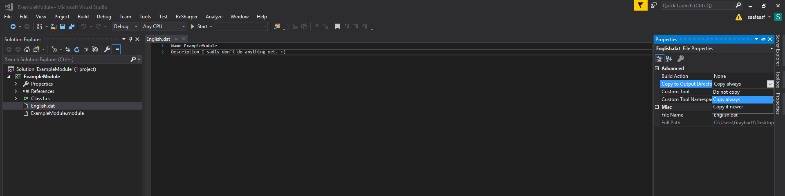

You can begin editing `English.dat` and add the following line:

```
Name <project_name>
Description <project_description>
```

Now edit `<file>.module` and add the following text:

```json
{
    "IsEnabled": true,
    "Name": "<project_name>",
    "Version": "1.0.0.0",
    "Assemblies":
    [
        {
            "Path": "/<project_name>.dll",
            "Role": "Server"
        }
    ]
}
```

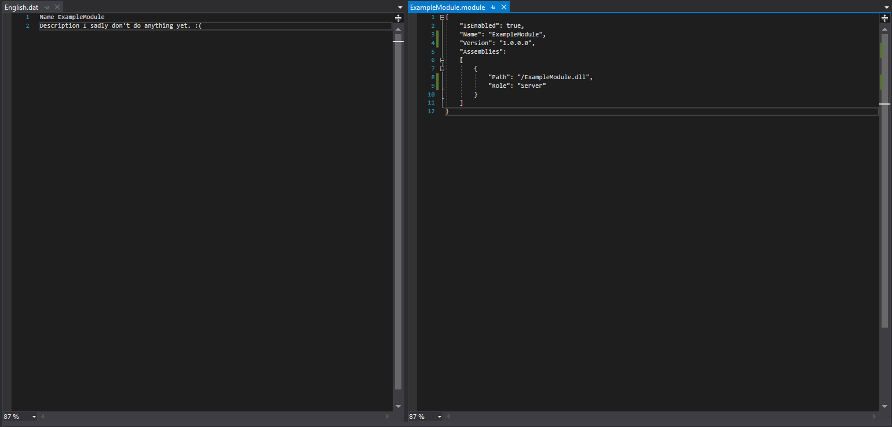

For more information about the `Role` section, see [EModuleRole](scripting/sdg/framework/modules/emodulerole)

## 5. Writing Some Code

When you created your project, it should've created a file called `Class1.cs`. Right click and rename this to whatever you want. i.e. `ExampleModuleNexus`

The file should now look something like this:

```csharp
using System;
using System.Collections.Generic;
using System.Linq;
using System.Text;

namespace ExampleModule
{
    public class ExampleModuleNexus
    {
    }
}
```

To start off, remove every `using` line except `using System;`.

```csharp
using System;

namespace ExampleModule
{
    public class ExampleModuleNexus
    {
    }
}
```

Now under `using System;` add `using SDG.Framework.Modules;`

```csharp
using System;
using SDG.Framework.Modules;

namespace ExampleModule
{
    public class ExampleModuleNexus
    {
    }
}
```

After your class-name, add `: IModuleNexus`. This forces your class to inherit from [IModuleNexus](scripting/sdg/framework/modules/imodulenexus) and will allow Unturned to find where to start in our code.

```csharp
using System;
using SDG.Framework.Modules;

namespace ExampleModule
{
    public class ExampleModuleNexus : IModuleNexus
    {
    }
}
```

You'll notice an error, this is the compiler informing us that we haven't fully implemented our class as a `IModuleNexus` as it requires any child-class to implement certain functions.

In our case, these functions match the following:

```csharp
public void initialize()
{

}

public void shutdown()
{

}
```

Our file should now look like this:

```csharp
using System;
using SDG.Framework.Modules;

namespace ExampleModule
{
    public class ExampleModuleNexus : IModuleNexus
    {
        public void initialize()
        {

        }

        public void shutdown()
        {

        }
    }
}
```

We are now nearing nearing completion!

Just so we know everything loaded correctly, add the following line inside your `initialize()` function:

`Console.WriteLine("Example module successfully loaded!");`

Your final file should look like this:

```csharp
using System;
using SDG.Framework.Modules;

namespace ExampleModule
{
    public class ExampleModuleNexus : IModuleNexus
    {
        public void initialize()
        {
            Console.WriteLine("Example module successfully loaded!");
        }

        public void shutdown()
        {

        }
    }
}
```

## 6. Building and Testing your Module

To build the module, simply navigate to and click `Build` -> `Build Solution`.

Once the build has succeeded, open back up your File Explorer and navigate to your project directory, then `<project_name>/bin/Debug`.

You should see something similar to this is the folder:

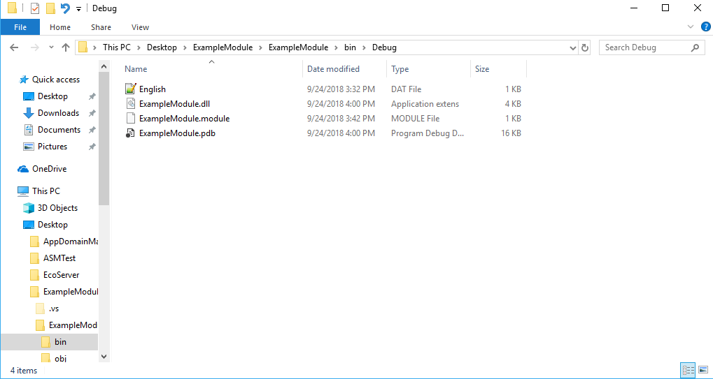

Now, in a seperate File Explorer window, navigate to your Unturned Server installation, then into the `Modules` folder.

Create a new folder in that directory with the name of your module.

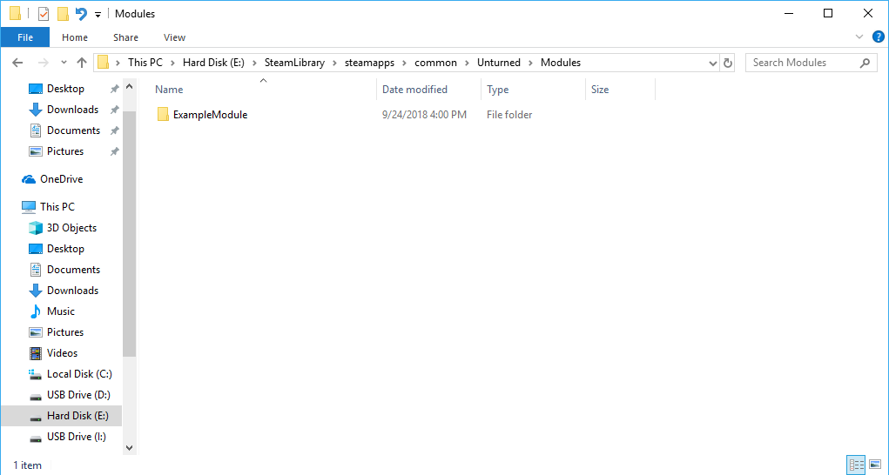

Finally, copy all the files from the `Debug` directory into the folder you created inside your server's `Modules` folder.

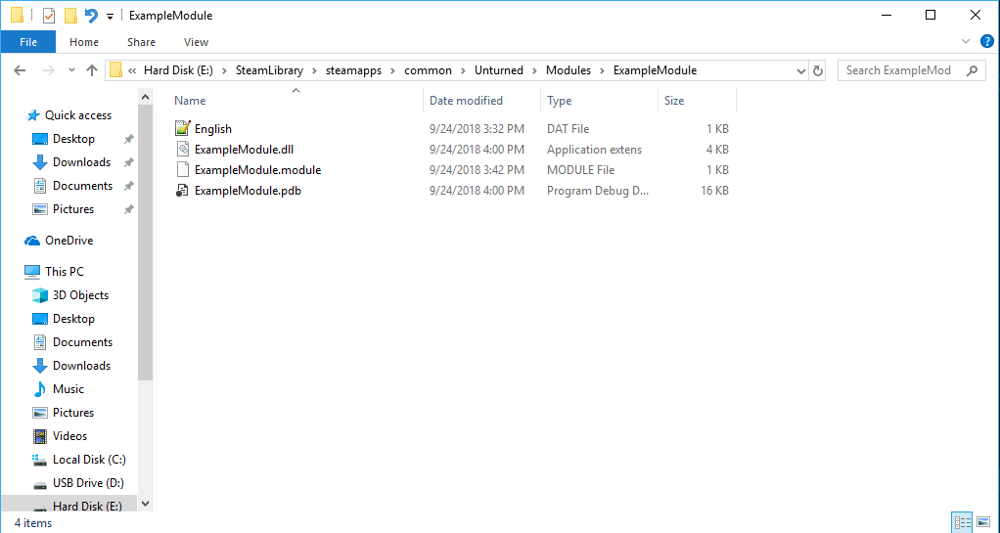

Launch the server and see your work in action!

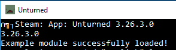