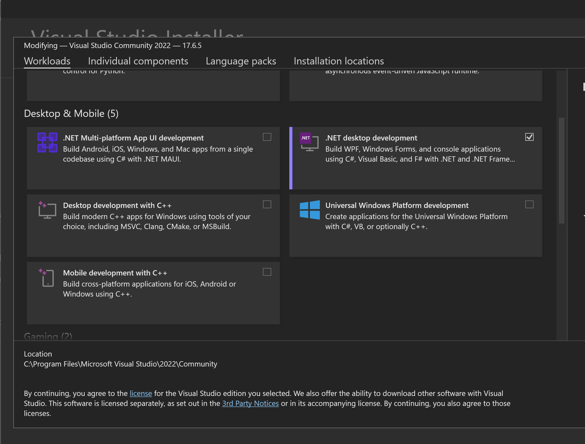

# Setting Up Visual Studio

[Visual Studio 2022](<https://visualstudio.microsoft.com/>) can be used for developing plugins and modules for Unturned. Being a free full-fleged IDE with Git control , Intellisense, and support for C# and .NET, it is the perfect solution for those who want to start programming.

After downloading [Visual Studio 2022](<https://visualstudio.microsoft.com/>) from Microsoft's website, you can open the 'Visual Studio Installer'. When modifying your installation select '.NET desktop development'.

